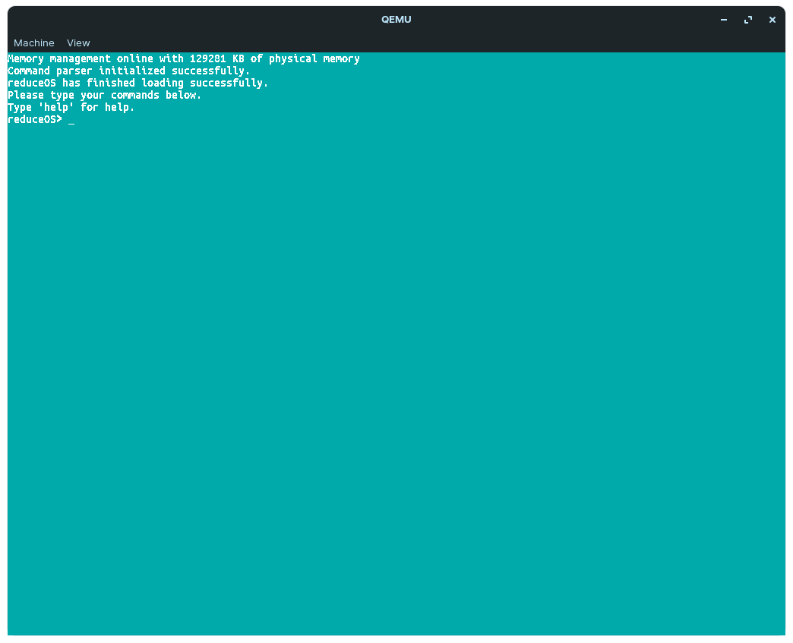

# reduceOS - the rewrite

Welcome to the in progress development of the new reduceOS.\
If you would like to learn more about the development of the kernel, scroll down.

#### Please read the credits!
### TEMPORARY NOTICE: reduceOS, due to limitations in my own knowledge of assembly and bootloaders, has switched in favor of multiboot. I am deeply sorry about this - I was hoping we wouldn't have to.

# What's different?
I've switched off multiboot in favor of a custom assembly bootloader and kernel. More features are coming in the kernel rewrite along with a ton of flaws and bugs fixed.\
More info coming soon.

# Why does it look so messy?
The assembly code shouldn't look that messy. If it is, start a pull request/contact me and I will update it.

# What's the current stage?
Improving physical memory handling, adding virtual memory handling (or paging handling)

# Compiling
### Again, even though we were having trouble with Linux builds before, Windows builds are NOT supported. Use WSL, mingw-32, or MSys to build.

**To build reduceOS, you need these packages:** `gcc`, `nasm`, `make`, `grub`, and `qemu-system` (for running)

The makefile of reduceOS has two main targets for building - `all` and `dbg`.\
The target to actually build the OS is `all`. If you need to do further debugging, use `dbg` **as well as** `all` (dbg only outputs some debugging symbols)

Run `make` to build the OS, or `make all dbg` if you're trying to debug it.

*TODO: Add image file writing.*

Finally, you need to launch the OS. This can be done in a variety of different ways, but the Makefile uses QEMU.\
Run `make qemu` to launch QEMU and start the OS.

# Known Bugs
- Serial logging can't handle a `\n` (doesn't reset X to 0)
- **Severe:** Paging isn't aligning the addresses properly (that or it's a bug with the terminal).
- **Probably severe:** Paging `kmalloc()` is working, but `kfree()` crashes on an `ASSERT()` function checking if - the header magic is equal to the HEAP_MAGIC, in which it's some random negative value.
- Command parser can't handle arguments.
- **Annoying:** Keyboard driver has a hard time keeping up.
- A little bit of disgusting code in `keyboardGetChar()` (unsure how to fix)
- Terminal scrolling can scroll the bottom bar of the screen sometimes (no way to fix easily, but not critical)
- No stack-smashing protector for printf (and a few other functions).

# Credits
OSDev Wiki - Great resource for anyone looking into OS development. Helped with a ton of the basic principles and code. Link [here](https://wiki.osdev.org/)

BrokenThorn Entertainment - Incredible tutorials on kernel design, very useful. Link [here](http://www.brokenthorn.com/Resources/OSDevIndex.html)

JamesM's kernel development tutorials - (no need for Internet Archive anymore) Really helped out with some of the basic concepts. Link [here](http://jamesmolloy.co.uk/tutorial_html/)